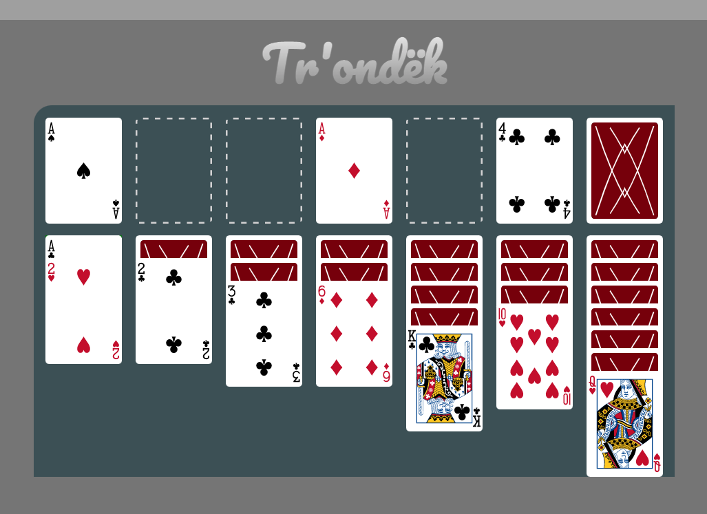

<h1 align="center"> Tr'ondëk </h1>

<h2>About</h2>

 

This is Tr'ondëk, also known as Klondike or Solitaire. 
The classic game was recreated using HTML, CSS, and vanilla JavaScript over the course of a week. 

The card game, Klondike, was said to have been named after the Tr'ondëk (The Klondike River), located in the Yukon Territory in North-Western Canada. 
Tr'ondëk means "hammer-rock river" in the Hän language, which is spoken by the First Nation Tr'ondëk Hwëch'in people. 

<h2>Roadmap</h2>
- [X] Initial conceptualization 
- [X] Wireframe & sketches 
- [X] Pseudocode 
- [ ] Working functions and DOM elements 
- [ ] First draft MVP 
- [ ] Testing and debugging 
- [ ] CSS styling 
- [ ] Final draft 
- [ ] Final deployment on Github 
- [ ] Optional additional versions: 
    - [ ] Language Support 
      - [ ] Japanese 
      - [ ] Spanish 
    - [ ] Styling 
      - [ ] color theme styling choices 

<h2>Pseudocode</h2>
<ol>
<li>(Optional) Start Page -> user click on button on start page -> start page dissolves revealing game board.</li>
<li>Button (located Row1 Col5) press by user resets game function and renders board.</li>
<li>Game-reset:
    <ol>
    <li>shuffle deck (back-end)</li>
    <li>deal cards in tableau-area (Row2 Col1:7) in standard Solitaire pattern (row=n, column: n cards), with all cards having back-side (the side that is the same and shared among all cards) facing towards user, and only the top card in each column having the face-side(the side that contains number and suit information) facing towards the user.</li>
    <li>assignment of states (card face up or down)</li>
    <li>load three cards that are face-up in stock area.</li>
    </ol></li>
<li>Drag and Drop movements:</li>
    <ol>
    <li>board is clickable, can be dragged and dropped using mouse cursor.</li>
    <li>only the card's 2-D area on the screen causes an event </li>
    <li>click and drag movement (cursor click followed by movement of mouse while holding the click) assigns data to the card object (the data includes the card that is picked up, and whether the card is facing up or facing down)</li>
    <li>movement of the clicked and dragged card across non-relevant areas on the board and outside the board are ignored. movement of the clicked and dragged card onto relevant areas are registered.</li>
    <li>dropping the card onto a relevant area results in function(s) to be run. The function(s) inputs the data contained by the clicked-and-dragged object and the dropped-on object.</li>
    <li>The function(s) compares:</li>
        <ol>
        <li>the start of where the card was dragged from vs the end of where the card was dropped-on to.</li>
            <ul>
            <li>from stock to tableau -> the color of the suit ('b' or 'r') are alternating, && the number of the suit (dragged card must have immediate and descending order compared to dropped-on card).</li>
            <li>from stock to foundation -> the type of suit ('S', 'H', 'C', 'D') are the same && the dragged card must be in immediate and ascending order compared to dropped-on card.</li>
            <li>from tableau to tableau -> the color of the suit ('b' or 'r') are alternating, && the number of the suit (dragged card must have immediate and descending order compared to dropped-on card).</li>
            <li>from tableau to tableau -> if the stack contains a King, the King and its descendants can be moved to an empty tableau column </li>
            <li>from tableau to foundation -> the type of suit ('S', 'H', 'C', 'D') are the same && the dragged card must be in immediate and ascending order compared to dropped-on card.</li>
            </ul>
        <li>the dragged card and dropped-on card must have the state of the card with face up</li>
            </ol> 
    </ol>
<li>Dealing cards:
    <ol>
    <li>up to three cards are displayed face-up, and playable, with the top-most card being playable (draggable and droppable).</li>
    <li>pressing deal button cause the playable cards to be placed into a waste area.</li>
    <li>three new cards are placed face-up in the stock area</li>
    <li>once the stock area is empty, the cards in the waste area are moved to the stock area.</li>
    </ol></li>
<li>When the waste area, stock area, and tableau contain no cards, there is a win. </li>
</ol>

<h2>License</h2>

<h2>Contact</h2>