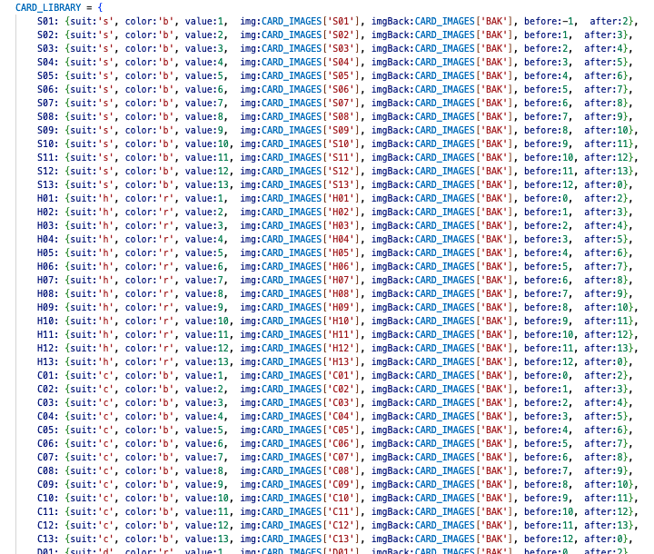
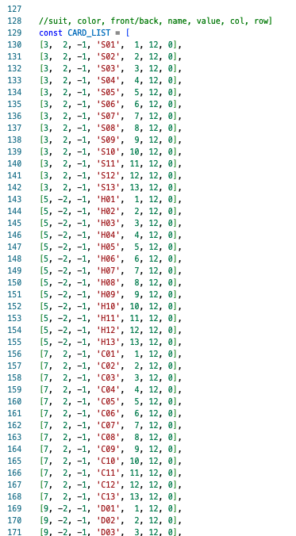
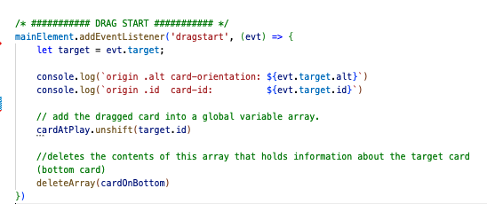

<h1 align="center"> Tr'ondëk </h1>

<h2>About</h2>

 

This is Tr'ondëk, also known as Klondike or Solitaire. 
The classic game was (or is in the process of being) recreated using HTML, CSS, and vanilla JavaScript over the course of a week (or more). 
<a href="https://yutaokkots.github.io/2023-solitaire/">You can play it here</a>, although it still has some work to be done. 

The card game, Klondike, was said to have been named after the Tr'ondëk (The Klondike River), located in the Yukon Territory in North-Western Canada. 
Tr'ondëk means "hammer-rock river" in the Hän language, which is spoken by the First Nation Tr'ondëk Hwëch'in people. 

I was inspired to work on this game because of the time I had spent <a href = "https://classic-mac.fandom.com/wiki/Klondike">playing Klondike at home</a>. 

<h2>The Gameplay</h2>
The current edition of the game includes a tableau area (bottom), and a foundation and stock area (top).
The purpose of the game is to get rid of the cards. 

 

With optimal gameplay (according to official, normal rules), during gameplay, cards in the tableau can only be placed in descending order and with alternating colors. The cards in the foundation area can only be added in ascending order, starting with the ace. Once a card is played in the tableau area, the card underneath can be revealed. 

New stock cards can be issued from stock to be used.  
However, in this version of the game, the shuffle button and play button are still stylistic, and are disabled. 

<h2>The Process</h2>

Although I do not have a currently working game to show a success, what I have gained is a deeper understanding of what not to do when taking on a difficult project. 

1) Although it might be obvious to people who are smarter than me, it's important to have a good idea of the balance of what is learning and what is doing, before the start of the project.

I was looking forward to working on this project because I knew I would be able to work on something I didn't understand. But the amount I didn't understand was much greater than I had anticipated. For example, I knew I had to use a good data structure that allows me to keep track of the moves of the card. 

Initially, I designed a reference table like this to be able to keep track of where things should go and not go. 

 

But as I was trying to incoporate the lessons I learned in class to implement this table, I realized it was difficult to manage this data. 

I tried to simplify the data sets using a smaller and more compact table. 

 

However, this is where I ran into challenges with balancing the writing of code to track the data and learning/refreshing HTML+CSS. 

2) One of the other things I had wish I was smarter about, was keeping things very, very simple. Even the above reference tables are over-complicated and were difficult to use. 

One of my favorite functions in this game, for example, is this:
`function flipCard (card) {     
    if (card[2] > 0){          
        card.splice(2, 1, -1)  
    }                          
    else {                     
        card.splice(2, 1, 1)   
    }                          
    return card;               `

because this is what it looks like to call the function:
`flipCard(card)`

My other favorite feature was learning about drag and drop. After working on this project, I know this is probably not best practices, but one of the ways that the user and the cards keep track of each other is through assigning data-ids (via dataSets) to the item (in this case, the images of the cards), and saving the information into a global variable (called 'cardAtPlay'). 

 

However, this is another example of making things a bit too complicated.

The game still has many bugs, and is difficult to use. However, even as the week deadline has arrived, I plan to continue working on the game, although the next version will probably be a much more simple version.   

<h2>License</h2>
Vector Playing Card Library 
VERSION 3.2 - RELEASED 6/27/2020

Licensed under https://www.gnu.org/licenses/lgpl-3.0.html

Chris Aguilar 
conjurenation@gmail.com         
https://totalnonsense.com/open-source-vector-playing-cards/

Alternate Joker by John Merrill
john@delirus.net
Colored version of alternate Joker by Chris Aguilar

<h2>Roadmap</h2>
- [X] Initial conceptualization 
- [X] Wireframe & sketches 
- [X] Pseudocode 
- [?] Working functions and DOM elements 
- [ ] First draft MVP 
- [ ] Testing and debugging 
- [ ] CSS styling 
- [ ] Final draft 
- [ ] Final deployment on Github 
- [ ] Optional additional versions: 
    - [ ] Language Support 
      - [ ] Japanese 
      - [ ] Spanish 
    - [ ] Styling 
      - [ ] color theme styling choices 
