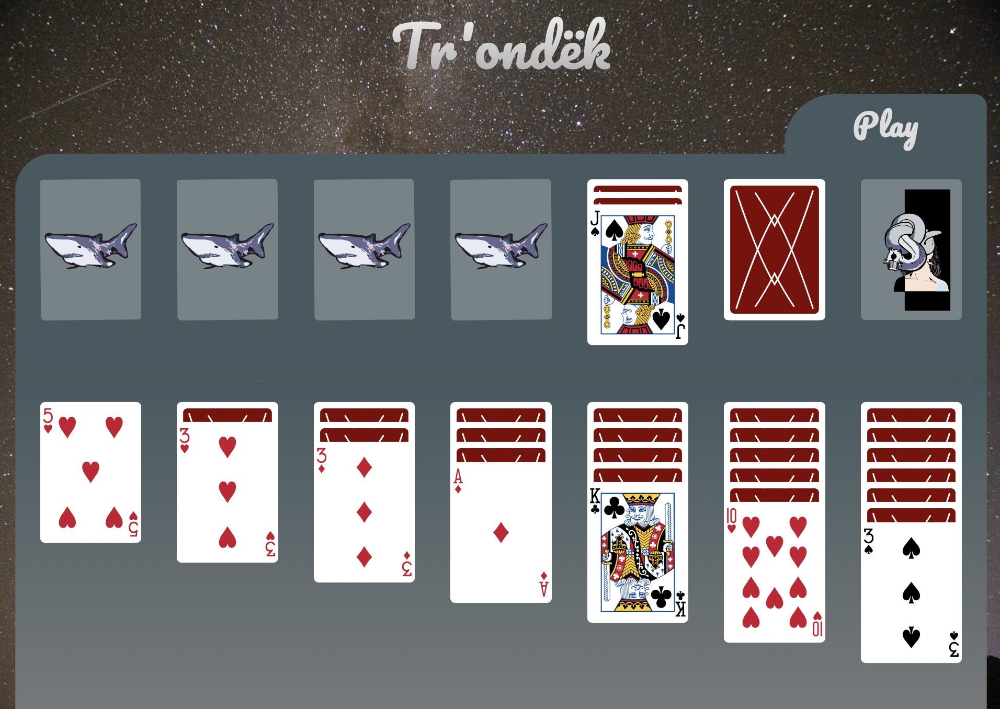

# Tr'ondëk

## by [Yuta Okkotsu](https://www.linkedin.com/in/yutaokkotsu/)

## [art portolio here](https://www.oktsdesign.com)

This is Tr'ondëk, also known as Klondike or Solitaire.  
The classic game was recreated using vanilla JavaScript, HTML, and CSS over the course of a several weeks as my first complete project on Github.  

# [Tr'ondek](https://yutaokkots.github.io/2023-solitaire/)

The card game, Klondike, was said to have been named after the Tr'ondëk (The Klondike River), located in the Yukon Territory in North-Western Canada.  
Tr'ondëk means "hammer-rock river" in the Hän language, which is spoken by the First Nation Tr'ondëk Hwëch'in people.  

I was inspired to work on this game because of the time I had spent <a href = "https://classic-mac.fandom.com/wiki/Klondike">playing Klondike at home</a>.  

# The Gameplay and Features

The point of the game is to play all of the stock cards (top-right), skillfully stack the cards in the tableau area (bottom), and organize the cards into the foundation area (top-left).  

In the tableau area, cards can only be stacked in descending order with alternating suit colors, with a King able to be placed in an empty area. 

In the foundation area, cards can only be stacked in ascending order with matching suits, starting with an ace. 

The cards can be moved by drag-and-drop, and pressing the play button will distribute up to three playable cards from the stock. 

 

# The Details

The game features 53 face cards and back card illustrated by Chris Aguiular. Information about the licenses are located below.  

The game includes original illustrations by me (Yuta Okkotsu), from the [Witch and the Shark series.](https://www.oktsdesign.com/witch-and-the-shark)   

# References

Vector Playing Card Library 
VERSION 3.2 - RELEASED 6/27/2020

Licensed under https://www.gnu.org/licenses/lgpl-3.0.html

Chris Aguilar 
conjurenation@gmail.com         
https://totalnonsense.com/open-source-vector-playing-cards/

Alternate Joker by John Merrill
john@delirus.net
Colored version of alternate Joker by Chris Aguilar

# Project Roadmap

Although the game is currently playable, an error occurs after winning a round.  

Next steps for the game will include fixing this bug, and including a score-board displayed on the screen. 

Additionally future updates will include adding saving the data on local storage on the client side, or database. 

